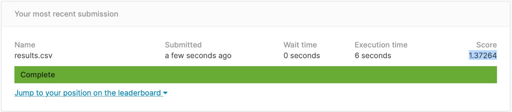

# Modelado

## Metodología de modelación del tipo de visitas de clientes en Walmart

En línea con lo mostrado en la etapa de análisis exploratorio, las visitas de los clientes de Walmart se asocian a combinaciones de artículos involucrados en sus transacciones. Tales se pueden abstraer a través de los departamentos en que las tiendas clasifican a su mercancia, puesto que no solo que corresponden a conjuntos de bienes de una naturaleza similar, sino que los ubican dentro de un mismo segmento del mercado en que los clientes identifican.

Ahora bien, motivados por tales hipótesis  y en razón de que para la base de datos de Walmart se decidió representar a las visitas que los clientes realizan a los establecimientos a travès de una unidad observacional que refleja en conjunto a la trasancción de artículos que hace cada cliente, en términos de la proporción de productos que comprar dentro de los departamentos, para proponer un modelo que
pueda capturar la relación entre los tipos de visitas que realizan los clientes y
dichas variables, se estimó pertinente explorar distintos modelos de aprendizaje de máquina.

La idea principal para plantearlos fue aprovechar el conocimiento de los datos de
Walmart, de manera que pudieran capturarse los efectos no lineales que se aprecian sobre las canastas de artìculos relativas a las transacciones de los clientes en cada visita. Algunos de los modelos que se conocen en la prática
que pueden reflejar dichas tendencias son aquellos basados en árboles o
ensambles de los mismos.

En tal sentido, se planteó la exploración de diversos modelos de aprendizaje de
máquina como los recién descritos, a través de una implementación de Python, en donde se calibraron sus hiper-parámetros mediante una técnica conocida como
validación cruzada.

Como resultado, se obtuvo un modelo, junto con sus correspondientes parámetros,
que tiene el mejor desempeño en la clasificación de las visitas de clientes del establecimiento referido.

Para mayor detalle, se invita al lector a consultar el archivo donde se llevó acabo la calibración de tales modelos junto con sus hiper-parámetros (*magic loop*), presente en la carpeta */build/modelado*.

## Performace de los diferentes modelos ajustados para el desarrollo del proyecto

A efecto de iliustrar el trabajo realizado bajo la metodologìa previamente descrita, a continuaciòmn se presentan capturas de pantalla de las puntuaciones obtenidas en la competencia de la página electrónica de Kaggle.

**Modelo inicial**

Este modelo fue de las primeros implementados, observando el peor desempeño. Se basó en una exploraciòn de modelo de máquinas de soporte vectorial con parámetros sin calibrar y un kernel genérico.

**Modelo logístico**

Desarrollado bajo una regresión logística para un problema de clasificación de múltiples clases, se obtuvo un mejor desempeño que el modelo inicial.

**Modelo Random Forest**

Este modelo resulto tener el mejor desempeño tras un proceso de calibración de hiper-parámetros conjugado con validación cruzada.

